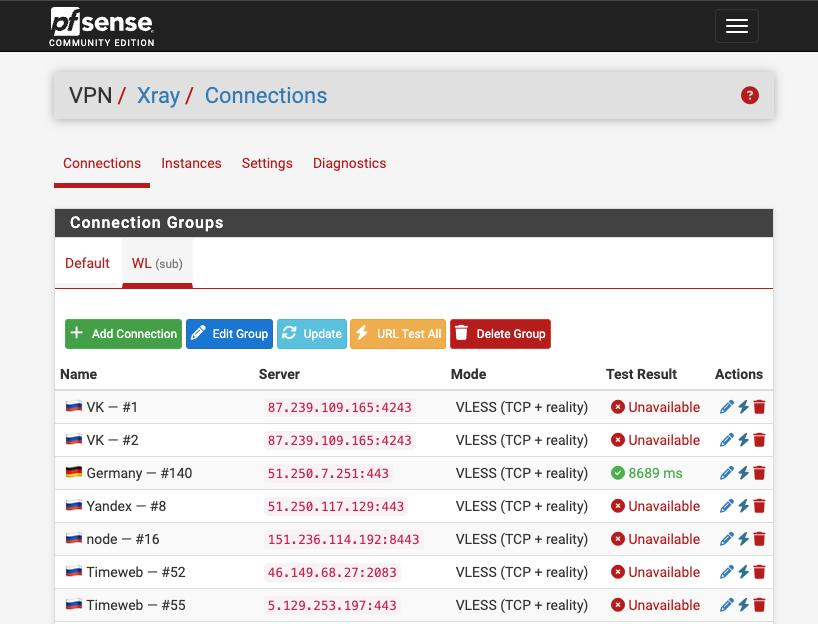

# pfSense-pkg-xray

[](LICENSE)
[](https://www.pfsense.org)
[](https://freebsd.org)
[](https://php.net)

**Xray-core VPN package for pfSense CE** — native GUI integration for VLESS+Reality tunnels with selective routing via pfSense Aliases and Firewall Rules.

[](screenshot)

Ported from [os-xray](https://github.com/MrTheory/os-xray) (OPNsense plugin). All core logic (config generation, VLESS parser, process management, watchdog) is preserved; only the framework layer is rewritten for pfSense.

---

## How It Works

```
xray-core  (VLESS+Reality outbound)
    ↓  SOCKS5  (127.0.0.1:10808, configurable)
hev-socks5-tunnel  (amd64)  /  tun2socks  (aarch64 fallback)
    ↓  TUN interface  (e.g. proxytun0)
pfSense Gateway  →  Firewall Rules  →  Selective routing
```

Traffic you want to tunnel is sent to the Xray gateway via pfSense policy-based routing — no changes to xray-core routing config are needed. Aliases and firewall rules work natively.

On **amd64**, [hev-socks5-tunnel](https://github.com/heiher/hev-socks5-tunnel) is used as the TUN bridge (~311 KB C binary). On **aarch64** (no hev release available), [tun2socks](https://github.com/xjasonlyu/tun2socks) is used as a fallback. The backend can be forced with `--backend` regardless of architecture.

---

## Features

- **Multi-instance** — run several independent VPN tunnels simultaneously, each with its own UUID, TUN interface, SOCKS5 port, and config
- **Connection groups** — organize connections into manual or subscription-based groups; each instance binds to a group
- **Subscription support** — fetch `vless://` links from a URL, auto-parse and sync connections (add / update / remove); auto-update every 30 minutes via cron
- **Connection rotation** — on start or watchdog trigger, URL-tests all connections in the group and activates the first working one
- **URL test** — per-connection reachability test via a temporary xray-core SOCKS5 instance; stores ping RTT result in the GUI
- **Wizard mode** — VLESS+Reality fields in the GUI (UUID, SNI, PublicKey, ShortID, Fingerprint, flow)
- **Custom JSON mode** — paste any xray-core `config.json` directly; supports all protocols and transports (xhttp, ws, grpc, h2, kcp, tcp)
- **VLESS link import** — paste a `vless://` link to auto-fill wizard fields; non-Reality transports automatically fall back to Custom JSON mode
- **Per-instance start / stop / restart** — without page reload, via AJAX
- **Live status badges** — xray-core + tun2socks status polled every 10 s
- **Config validation** — dry-run via `xray -test` before start, without touching the running service
- **Test Connection** — verifies the tunnel is actually proxying (HTTP check through SOCKS5)
- **Diagnostics page** — TUN IP, MTU, bytes/packets in/out, process uptime, ping RTT to VPN server
- **Log viewer** — last 200 lines of xray-core log and last 100 lines of watchdog log in the GUI
- **Watchdog** — cron-based crash recovery (per minute); respects manual stop (stopped flag)
- **Auto-start on boot** — FreeBSD rc.d script (`/usr/local/etc/rc.d/xray.sh`)
- **Bypass Networks** — configurable CIDR list routed directly, not through Xray
- **Webhook notifications** — per-instance and global webhook called when rotation finds no working connection

---

## Requirements

| Component  | Version                     |
| ---------- | --------------------------- |
| pfSense CE | 2.7.x / 2.8.x               |
| FreeBSD    | 14.x / 15.x amd64 / aarch64 |
| PHP        | 8.2 / 8.3                   |
| xray-core          | 24.x or later (recommended)     |
| hev-socks5-tunnel  | 2.x (amd64)                     |
| tun2socks          | 2.x (aarch64 fallback)          |

> **Architecture note:** `install.sh` auto-detects `amd64` and `aarch64`. On amd64, `hev-socks5-tunnel` is used by default; on aarch64, `tun2socks` is used. Use `--backend` to override.

---

## Installation

### One-line install (recommended)

SSH into pfSense and run:

```sh
fetch -o /tmp/install.sh https://raw.githubusercontent.com/pdazcom/pfSense-pkg-xray/main/install.sh && sh /tmp/install.sh
```

> **Why `fetch` instead of `curl`?** pfSense/FreeBSD ships `fetch` by default. `curl` may not be available without installing it separately.

The script will:

- Download `xray-core` and `hev-socks5-tunnel` (amd64) or `tun2socks` (aarch64) from GitHub Releases
- Install binaries to `/usr/local/bin/xray-core` and `/usr/local/tun2socks/`
- Copy all package files to the correct pfSense filesystem locations
- Load the `if_tun` kernel module
- Configure log rotation (`/etc/newsyslog.conf.d/xray.conf`)
- Register the package in pfSense (adds **VPN → Xray** menu)

### Step 2 — Enable the package

Open pfSense web UI → **VPN → Xray → Settings** → check **Enable Xray** → **Save**.

---

### Alternative: install via git clone

If you prefer to have the full source available (e.g. for development or customization):

```sh
cd /tmp
git clone https://github.com/pdazcom/pfSense-pkg-xray.git
cd pfSense-pkg-xray
sh install.sh
```

> `git` is not installed on pfSense by default. Install it first: **System → Package Manager → Available Packages** → search `git` → Install.

---

## install.sh Commands

```sh
# Full install (default)
sh install.sh

# Update files after git pull, restart instances
sh install.sh update

# Update files only, skip binary download
sh install.sh update --no-binaries

# Download/update binaries only
sh install.sh download-binaries

# Pin specific versions
sh install.sh --xray-version 25.4.30 --hev-version 2.14.4 --t2s-version 2.5.2

# Force a specific tunnel backend (overrides arch detection)
sh install.sh download-binaries --backend tun2socks
sh install.sh download-binaries --backend hev

# Full uninstall (stops services, removes files, cleans pfSense config)
sh install.sh uninstall
```

---

## GUI Setup

### Add connections

**VPN → Xray → Connections**

Connections are organized into groups. There is always a **Default** group for manually managed connections.

#### Manual connection

1. Select a group (or use Default) → **Add Connection**
2. Expand **Import from VLESS Link** → paste link → **Parse & Fill**, or fill fields manually
3. **Save**

#### Subscription group

1. **Add Group** → set type to **Subscription**, enter the subscription URL
2. Optionally enable **Auto-update** (updates every 30 minutes via cron)
3. **Save** → **Update Now** to fetch and sync connections immediately

After updating, the connections list shows a ping result badge for each entry (run **URL Test** to populate it).

---

### Add an instance

**VPN → Xray → Instances → Add Instance**

1. Select a **Connection Group** — the instance will use connections from this group
2. Set **TUN Interface** name (e.g. `proxytun0`) — must be unique per instance
3. Set **SOCKS5 Port** — must be unique per instance (default: `10808`)
4. **Save** → **Start**

On start, the instance runs connection rotation: it URL-tests each connection in the group and activates the first working one. The active connection is shown in the instance list.

---

## Selective Routing

After starting an instance, configure pfSense to route selected traffic through Xray.

### 1. Create a Gateway

**System → Routing → Gateways → Add**:

- Interface: select the Xray TUN interface (appears as OPTx)
- Gateway IP: TUN IP + 1 (shown in **Diagnostics → TUN IP**)
  (e.g. if TUN IP is `10.100.66.46`, gateway is `10.100.66.47`)
- Name: `XRAY_GW`
- Monitor IP: same as Gateway IP (`10.100.66.47`) — **important**: do not use an external IP,
  ICMP won't pass through the tunnel and the gateway will be marked down

### 2. Create an Alias

**Firewall → Aliases → Add**:

- Type: Network(s), Host(s), or URL Table
- Add the IPs, subnets, or domains you want to route through Xray
- Example URL Table: `https://antifilter.download/list/allyouneed.lst`

### 3. Create a Firewall Rule

**Firewall → Rules → LAN → Add** (place above the default allow rule):

- Action: Pass
- Protocol: TCP/UDP
- Source: LAN net (or specific hosts)
- Destination: your Alias
- Advanced Options → Gateway: `XRAY_GW`
- **Save** → **Apply Changes**

---

## Diagnostics

**VPN → Xray → Diagnostics**

- Select instance from dropdown
- **Refresh** — loads TUN interface stats (IP, MTU, bytes in/out, process uptime)
- **Test Connection** — sends HTTP request through SOCKS5 proxy, shows HTTP status code
- **xray-core Log** — last 200 lines of `/var/log/xray-core.log`
- **Watchdog Log** — last 100 lines of `/var/log/xray-watchdog.log`

---

## Updating

```sh
fetch -o /tmp/install.sh https://raw.githubusercontent.com/pdazcom/pfSense-pkg-xray/main/install.sh && sh /tmp/install.sh update
```

Or, if installed via git clone:

```sh
cd /tmp/pfSense-pkg-xray
git pull
sh install.sh update
```

---

## Uninstalling

```sh
fetch -o /tmp/install.sh https://raw.githubusercontent.com/pdazcom/pfSense-pkg-xray/main/install.sh && sh /tmp/install.sh uninstall
```

Or, if installed via git clone:

```sh
cd /tmp/pfSense-pkg-xray
sh install.sh uninstall
```

Then manually remove in pfSense UI:

- **System → Routing → Gateways** — delete `XRAY_GW`
- **Firewall → Rules** — delete rules that used `XRAY_GW`

---

## File Structure

```
pfSense-pkg-xray/
├── pkg/
│   └── xray.xml                              # Package manifest (menus, hooks, cron)
├── files/
│   ├── usr/local/www/xray/
│   │   ├── xray_connections.php              # Connection groups + connections list
│   │   ├── xray_connection_edit.php          # Create/edit connection + VLESS import
│   │   ├── xray_group_edit.php               # Create/edit connection group (manual/subscription)
│   │   ├── xray_instances.php                # Instance list + live status (AJAX polling)
│   │   ├── xray_edit.php                     # Create/edit instance
│   │   ├── xray_settings.php                 # Global settings (enable, watchdog, test URL, webhook)
│   │   ├── xray_diagnostics.php              # TUN stats, logs, connection test
│   │   └── xray_ajax.php                     # AJAX dispatcher + VLESS parser
│   ├── usr/local/pkg/
│   │   └── xray/includes/
│   │       ├── xray.inc                      # Config R/W, TUN registration, hooks, group/connection helpers
│   │       ├── xray_connections.inc          # Connection CRUD backed by JSON file (CLI-safe)
│   │       ├── xray_vless.inc                # VLESS link parser
│   │       ├── xray_validate.inc             # Input validation (instances, connections, groups)
│   │       └── xray_foot.inc                 # Footer include
│   ├── usr/local/scripts/xray/
│   │   ├── xray-service-control.php          # Process management (start/stop/status/validate)
│   │   ├── xray-watchdog.php                 # Crash recovery daemon
│   │   ├── xray-rotation.php                 # Connection rotation (URL-test group, pick winner)
│   │   ├── xray-urltest.php                  # URL-test a single connection via temporary xray-core
│   │   ├── xray-urltest-group.php            # Async group URL-test (one xray-core, writes progress JSON)
│   │   ├── xray-subscription-update.php      # Fetch & sync subscription group connections
│   │   ├── xray-subscription-autoupdate.php  # Cron wrapper: auto-update all subscription groups
│   │   ├── xray-ifstats.php                  # TUN interface statistics + ping
│   │   └── xray-testconnect.php              # SOCKS5 connectivity test
│   └── usr/local/etc/rc.d/
│       └── xray.sh                           # FreeBSD rc.d boot script
└── install.sh                                # Install / update / uninstall script
```

---

## Runtime Files

All runtime files are named by instance UUID to avoid conflicts between instances:

| File                                          | Purpose                                               |
| --------------------------------------------- | ----------------------------------------------------- |
| `/usr/local/etc/xray-core/config-{uuid}.json` | xray-core config                                      |
| `/usr/local/etc/xray-core/connections.json`   | Connections store (all groups)                        |
| `/usr/local/tun2socks/config-{uuid}.yaml`     | tunnel bridge config (hev or tun2socks format)        |
| `/usr/local/tun2socks/backend.txt`            | active backend: `hev` or `tun2socks`                  |
| `/var/run/xray_core_{uuid}.pid`               | xray-core PID                                         |
| `/var/run/tunnel_{uuid}.pid`                  | tunnel bridge PID (hev-socks5-tunnel or tun2socks)    |
| `/var/run/xray_start_{uuid}.lock`             | Per-instance startup lock (flock)                     |
| `/var/run/xray_stopped_{uuid}.flag`           | Manual stop marker (watchdog skips)                   |
| `/var/log/xray-core.log`                      | xray-core + tunnel bridge stderr output               |
| `/var/log/xray-watchdog.log`                  | Watchdog restart events + subscription autoupdate log |

---

## Troubleshooting

**Service won't start**

```sh
# Check xray-core config syntax
php /usr/local/scripts/xray/xray-service-control.php validate <uuid>

# Check xray-core log
tail -50 /var/log/xray-core.log

# Manual start
php /usr/local/scripts/xray/xray-service-control.php start <uuid>
```

**TUN interface doesn't appear**

```sh
# Check if if_tun module is loaded
kldstat | grep if_tun
kldload if_tun

# Check which tunnel backend is active
cat /usr/local/tun2socks/backend.txt

# Check tunnel process is running
ps aux | grep -E 'hev-socks5|tun2socks'

# Check interface
ifconfig proxytun0
```

**Gateway is marked down**

Make sure **Monitor IP** is set to the gateway peer address (TUN IP + 1, e.g. `10.100.66.47` when TUN IP is `10.100.66.46`), not an external IP. The tunnel bridge does not forward ICMP, so pinging external IPs through the gateway will always fail.

**Traffic not routing through tunnel**

```sh
# Test SOCKS5 directly
curl --socks5 127.0.0.1:10808 -s -o /dev/null -w '%{http_code}' https://1.1.1.1

# Check firewall rule has the correct gateway
# Check the alias contains the destination IPs
pfctl -t <alias_name> -T show | head -20
```

**Watchdog keeps restarting**

```sh
tail -f /var/log/xray-watchdog.log
tail -100 /var/log/xray-core.log
```

---

## Credits

- [Xray-core](https://github.com/XTLS/Xray-core) — the proxy engine
- [hev-socks5-tunnel](https://github.com/heiher/hev-socks5-tunnel) — lightweight SOCKS5 to TUN bridge (amd64)
- [tun2socks](https://github.com/xjasonlyu/tun2socks) — SOCKS5 to TUN bridge (aarch64 fallback)
- [os-xray](https://github.com/MrTheory/os-xray) — OPNsense plugin this is ported from

---

## License

BSD 2-Clause License.

This package is a derivative work of [os-xray](https://github.com/MrTheory/os-xray)
by Pavel, licensed under the BSD 2-Clause License. The original copyright notice
is retained in the [LICENSE](LICENSE) file as required by the license terms.

Core logic ported from os-xray:

- `xray-service-control.php` — config generation, process management, VLESS+Reality config builder
- `xray-watchdog.php` — crash recovery daemon
- `xray-ifstats.php` — TUN interface statistics
- `xray-testconnect.php` — SOCKS5 connectivity test
- VLESS link parser (`xray_ajax.php`) — ported from `ImportController.php`

The pfSense framework layer (package manifest, GUI pages, `xray.inc`, `xray_validate.inc`, `xray.sh`) is original work.
